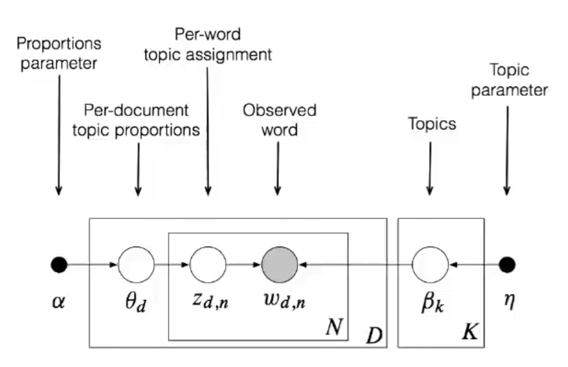

**Reference**: [Variational Inference: Foundations and Modern Methods - David Blei, Shakir Mohamed](https://www.youtube.com/watch?v=ogdv_6dbvVQ) (NIPS 2016 tutorial)

# Part 1: Background
* **Probabilistic Pipeline**
	* (Assumptions -> Model, Data) -> Discover Patterns -> Predict & Explore
* **Probabilistic Machine Learning**
    * probabilistic model: p(z, x)
        * z - hidden. variables
        * x - observed variables
    * inference about unknowns through the **posterior**: $p(z | x) = \frac{p(z, x)}{p(x)}$ 
        * For most interesting models, the denominator is intractable
        * Hence **approximate posterior inference** is required
            * MCMC  - forms a Markov Chain whose stationary distribution is $p(z|x)$
            * Variational Inference
* **Variational Inference**
    * 
    * VI turns **inference into optimization**.
    * Posit a **variational family** of distributions over the latent variables, $q(\mathbf{z} ; \boldsymbol{v})$
    * Fit the **variational parameters** $\nu$ to be close (in $\mathrm{KL}$) to the exact posterior. 
        * There are alternative divergences, which connect to algorithms like EP, BP, and others.
* Posterior Predictive Distributions
* Modern VI: probabilistic programming, RL, NNs, Convex optimization, Bayesian Statistics
* VI + Stochastic Optimisation
    * scale up VI to massive data
    * enable VI on a wide class of difficult models
    * enable VI with elaborate and flexible families of approximations
# Part 2: Mean-field VI and Stochastic VI
* Topic models: Use posterior inference to discover the hidden thematic structure in a large collection of documents. Eg. LDA
* LDA
    * 

    * idea:
        * Each **topic** is a distribution over words
        * Each **document** is a mixture of corpus-wide topics
        * Each **word** is drawn from one of those topics
    * A **Mixed Membership model** for which the Z is intractable.
    * $p(\beta, \boldsymbol{\theta}, \mathbf{z} \mid \mathbf{w})=\frac{p(\beta, \boldsymbol{\theta}, \mathbf{z}, \mathbf{w})}{\int_{\beta} \int_{\boldsymbol{\theta}} \sum_{\mathbf{z}} p(\beta, \boldsymbol{\theta}, \mathbf{z}, \mathbf{w})}$
    * The denominator, $p(w)$ is intractable and requires approximate inference.
Define the generic class of conditionally conjugate models
Derive classical mean-field VI
Derive stochastic VI, which scales to massive data
## Generic Class of Conditionally Conjugate Models
* 
* The **observations** are $\mathbf{x}=x_{1: n}$
* The **local variables** are $\mathbf{z}=z_{1: n}$
* The **global variables** are $\beta$.
* The ith data point $x_{i}$ only depends on $z_{i}$ and $\beta$.
* Compute $p(\beta, \mathbf{z}, \mathbf{x})=p(\beta) \prod_{i=1}^{n} p\left(z_{i}, x_{i} \mid \beta\right)$
* A **complete conditional** is the conditional of a latent variable given the observations and other latent variables.
* Assume each complete conditional is in the exponential family,
    * $\begin{aligned} p\left(z_{i} \mid \beta, x_{i}\right) &=h\left(z_{i}\right) \exp \left\{\eta_{\ell}\left(\beta, x_{i}\right)^{\top} z_{i}-a\left(\eta_{\ell}\left(\beta, x_{i}\right)\right)\right\} \\ p(\beta \mid \mathbf{z}, \mathbf{x}) &=h(\beta) \exp \left\{\eta_{g}(\mathbf{z}, \mathbf{x})^{\top} \beta-a\left(\eta_{g}(\mathbf{z}, \mathbf{x})\right)\right\} \end{aligned}$
* The global parameter comes from conjugacy and has a particular form: [Bernardo and Smith, 1994]
    * $\eta_{g}(\mathbf{z}, \mathbf{x})=\alpha+\sum_{i=1}^{n} t\left(z_{i}, x_{i}\right)$
    * where $\alpha$ is a hyperparameter and $t(\cdot)$ are sufficient statistics for $\left[z_{i}, x_{i}\right] .$
* Examples:
    * Bayesian mixture models
    * Time series models
    * Factorial models
    * Matrix Factorization
    * Mixed-membership models (LDA etc.)
    * etc.
* **Evidence Lower Bound**
    * $\mathscr{L}(\boldsymbol{v})= \mathbb{E}_{\beta, z \sim q}[\log p(\beta, \mathbf{z}, \mathbf{x})]-\mathbb{E}_{\beta, z \sim q}[\log q(\beta, \mathbf{z} ; \boldsymbol{v})]$
        * FIrst term is _expected likelihood_ and the second is _entropy_.
    * KL is intractable as it requires knowing the posterior itself
    * VI optimizes the evidence lower bound (ELBO) instead which is a lower bound on $\log p(\mathbf{x})$. 
        * Maximizing the ELBO is equivalent to minimizing the KL.
    * The ELBO trades off two terms.
        * The first term prefers $q(\cdot)$ to place its mass on the MAP estimate. 
        * The second term (entropy of $q$) encourages $q(\cdot)$ to be diffuse.
    * _Caveat_: The ELBO is not convex.
        * => Find a local optimum
* **Mean-Field Family**
    * 

    * A form of $q(\beta, \mathbf{z})$.
    * **Fully factorized**: All latent variables are independent and governed by their on variational parameters.
        * $q(\beta, \mathbf{z} ; \lambda, \phi)=q(\beta ; \lambda) \prod_{i=1}^{n} q\left(z_{i} ; \phi_{i}\right)$
    * Each factor is the same family as the model's complete conditional,
        * $\begin{aligned} p(\beta \mid \mathbf{z}, \mathbf{x}) &=h(\beta) \exp \left\{\eta_{g}(\mathbf{z}, \mathbf{x})^{\top} \beta-a\left(\eta_{g}(\mathbf{z}, \mathbf{x})\right)\right\} \\ q(\beta ; \lambda) &=h(\beta) \exp \left\{\lambda^{\top} \beta-a(\lambda)\right\} \end{aligned}$

## Classical Mean Field VI
* Optimize the ELBO, $\mathscr{L}(\lambda, \boldsymbol{\phi})=\mathbb{E}_{q}[\log p(\beta, \mathbf{z}, \mathbf{x})]-\mathbb{E}_{q}[\log q(\beta, \mathbf{z})]$
* **Traditional VI uses coordinate ascent** [Ghahramani and Beal, 2001]
    * $\lambda^{*}=\mathbb{E}_{\phi}\left[\eta_{g}(\mathbf{z}, \mathbf{x})\right]$
    * $\phi_{i}^{*}=\mathbb{E}_{\lambda}\left[\eta_{\ell}\left(\beta, x_{i}\right)\right]$
* Iteratively update each parameter, holding others fixed. 
    * Notice the relationship to Gibbs sampling [Gelfand and Smith, 1990]
        * In Gibbs Sampling we iteratively sample from the distributions, 
            * In VI we set it to the expectation 
    * Caveat: The ELBO is not convex. 
* **Mean Field VI for LDA**
    * 
    * The local variables are the per-document variables $\theta_{d}$ and $\mathbf{z}_{d}$.
    * The global variables are the topics $\beta_{1}, \ldots, \beta_{K}$
    * The variational distribution is 
    * $q(\beta, \boldsymbol{\theta}, \mathbf{z})=\prod_{k=1}^{K} q\left(\beta_{k} ; \lambda_{k}\right) \prod_{d=1}^{D} q\left(\theta_{d} ; \gamma_{d}\right) \prod_{n=1}^{N} q\left(z_{d, n} ; \phi_{d, n}\right)$
* 
* _Algorithm_
    * **Input**: data x, model $p(\beta, \mathbf{z}, \mathbf{x})$.
    * Initialize $\lambda$ randomly.
    * repeat until the ELBO has converged:
        * for each data point i:
            * Set local parameter $\phi_{i} \leftarrow \mathbb{E}_{\lambda}\left[\eta_{\ell}\left(\beta, x_{i}\right)\right]$
        * Set global parameter $\lambda \leftarrow \alpha+\sum_{i=1}^{n} \mathbb{E}_{\phi_{i}}\left[t\left(Z_{i}, x_{i}\right)\right]$
* _Problem_: Classical VI is inefficient
    * Need to local computation for each data point, aggregate them to reestimate the global structure and repeat.
* _Solution_: Stochastic VI scales VI to massive data.

## Stochastic VI

* **Stochastic Optimization**
    * With noisy gradients, update
        * $v_{t+1}=v_{t}+\rho_{t} \hat{\nabla}_{v} \mathscr{L}\left(v_{t}\right)$
    * Requires unbiased gradients, $\mathbb{E}\left[\hat{\nabla}_{\nu} \mathscr{L}(v)\right]=\nabla_{v} \mathscr{L}(v)$
    * Requires the step size sequence $\rho_{t}$ follows the Robbins-Monro conditions
* **Stochastic VI**
    * The natural gradient of the ELBO [Amari, 1998; Sato, 2001]
        * $\nabla_{\lambda}^{\mathrm{nat}} \mathscr{L}(\lambda)=\left(\alpha+\sum_{i=1}^{n} \mathbb{E}_{\phi_{i}^{*}}\left[t\left(Z_{i}, x_{i}\right)\right]\right)-\lambda$
        * second term is the sum of expectations of the sufficient statistics.
    * Construct a noisy natural gradient,
        * $\begin{aligned} j & \sim \text { Uniform }(1, \ldots, n) \\ \hat{\nabla}_{\lambda}^{\text {nat }} \mathscr{L}(\lambda) &=\alpha+n \mathbb{E}_{\phi_{j}^{*}}\left[t\left(Z_{j}, x_{j}\right)\right]-\lambda \end{aligned}$
    * This is a good noisy gradient.
        * Its expectation is the exact gradient (unbiased). 
        * It only depends on optimized parameters of one data point (cheap).
    * _Algorithm_:
        * Input: data x, model $p(\beta, \mathbf{z}, \mathbf{x})$.
        * Initialize $\lambda$ randomly.  Set $\rho_{t}$ appropriately.
        * repeat until forever
            * Sample $j \sim \operatorname{Unif}(1, \ldots, n)$
            * Set local parameter $\phi \leftarrow \mathbb{E}_{\lambda}\left[\eta_{\ell}\left(\beta, x_{j}\right)\right]$
            * Set intermediate global parameter $\hat{\lambda}=\alpha+n \mathbb{E}_{\phi}\left[t\left(Z_{j}, x_{j}\right)\right]$
            * Set global parameter $\lambda=\left(1-\rho_{t}\right) \lambda+\rho_{t} \hat{\lambda}$
    * Eg. LDA
            1. Sample a document
            2. Estimate the local variational parameters using the current topics
            3. Form intermediate topics from those local parameters
            4. Update topics as a weighted average of intermediate and current topics

# Part 3: Stochastic gradients of the ELBO
## VI Recipe
* 

* Start with a model: $p(z, x)$
* Choose a variational approximation: $q(\mathbf{z} ; \boldsymbol{v})$
* Write down the ELBO: $\mathscr{L}(\boldsymbol{v})=\mathbb{E}_{q(\mathbf{z} ; \boldsymbol{v})}[\log p(\mathbf{x}, \mathbf{z})-\log q(\mathbf{z} ; \boldsymbol{v})]$
* Take derivatives: $\nabla_{v} \mathscr{L}$
* Optimize: $v_{t+1}=v_{t}+\rho_{t} \nabla_{v} \mathscr{L}$
* Example: Bayesian Logistic Regression
    * Data pairs $y_{i}, x_{i}$
    * $x_{i}$ are covariates
    * $y_{i}$ are label
    * $z$ is the regression coefficient
    * Generative process 
        * $\begin{aligned} p(z) & \sim N(0,1) \\ p\left(y_{i} \mid x_{i}, z\right) & \sim \operatorname{Bernoulli}\left(\sigma\left(z x_{i}\right)\right) \end{aligned}$
    * VI for Bayesian LR
        * Assume:
            * We have one data point $(y, x)$
            * $x$ is a scalar
            * The approximating family $q$ is the normal; $\boldsymbol{v}=\left(\mu, \sigma^{2}\right)$
        * The ELBO is
            * $\begin{aligned} \mathscr{L}\left(\mu, \sigma^{2}\right) &=\mathbb{E}_{q}[\log p(z)+\log p(y \mid x, z)-\log q(z)] \\ &= \mathbb{E}_{q}[\log p(z)-\log q(z)+\log p(y \mid x, z)] \\ &=-\frac{1}{2}\left(\mu^{2}+\sigma^{2}\right)+\frac{1}{2} \log \sigma^{2}+\mathbb{E}_{q}[\log p(y \mid x, z)]+C \\ &=-\frac{1}{2}\left(\mu^{2}+\sigma^{2}\right)+\frac{1}{2} \log \sigma^{2}+\mathbb{E}_{q}[y x z-\log (1+\exp (x z))] \\ &=-\frac{1}{2}\left(\mu^{2}+\sigma^{2}\right)+\frac{1}{2} \log \sigma^{2}+y x \mu-\mathbb{E}_{q}[\log (1+\exp (x z))] \end{aligned}$
            * We are stuck.
                * We cannot analytically take that expectation.
                * The expectation hides the objectives dependence on the variational parameters. This makes it hard to directly optimize.
    * Want a blackbox VI algorithm that works for non-Conjugate models as well.
## New Blackbox VI recipe
* 

* Define $g(\mathbf{z}, \boldsymbol{v})=\log p(\mathbf{x}, \mathbf{z})-\log q(\mathbf{z} ; \boldsymbol{v})$
* $\begin{aligned} \nabla_{v} \mathscr{L} &=\nabla_{v} \int q(\mathbf{z} ; \boldsymbol{v}) g(\mathbf{z}, \boldsymbol{v}) d \mathbf{z} \\ &=\int \nabla_{v} q(\mathbf{z} ; \boldsymbol{v}) g(\mathbf{z}, \boldsymbol{v})+q(\mathbf{z} ; \boldsymbol{v}) \nabla_{v} g(\mathbf{z}, \boldsymbol{v}) d \mathbf{z} \\ &=\int q(\mathbf{z} ; \boldsymbol{v}) \nabla_{v} \log q(\mathbf{z} ; \boldsymbol{v}) g(\mathbf{z}, \boldsymbol{v})+q(\mathbf{z} ; \boldsymbol{v}) \nabla_{\boldsymbol{v}} g(\mathbf{z}, \boldsymbol{v}) d \mathbf{z} \\ &=\mathbb{E}_{q(\mathbf{z} ; \boldsymbol{v})}\left[\nabla_{\boldsymbol{v}} \log q(\mathbf{z} ; \boldsymbol{v}) g(\mathbf{z}, \boldsymbol{v})+\nabla_{v} g(\mathbf{z}, \boldsymbol{v})\right] \end{aligned}$
### Score-Function Gradients
* Simplify $\nabla_{\nu} \mathscr{L}$: 
    * $\mathbb{E}_{q}\left[\nabla_{\nu} g(\mathbf{z}, \boldsymbol{v})\right] = \mathbb{E}_{q}\left[\nabla_{\nu} \log q(\mathbf{z} ; \boldsymbol{v})\right] = 0$
        * [score function has expectation zero](http://blog.shakirm.com/2015/11/machine-learning-trick-of-the-day-5-log-derivative-trick/)
* Gives the gradient: 
    * $\nabla_{v} \mathscr{L}=\mathbb{E}_{q(\mathbf{z} ; \boldsymbol{v})}\left[\nabla_{\nu} \log q(\mathbf{z} ; \boldsymbol{v})(\log p(\mathbf{x}, \mathbf{z})-\log q(\mathbf{z} ; \boldsymbol{v}))\right]$
    * Called **Score Function Estimator** or **likelihood ratio** or **REINFORCE gradients**
* **Noisy Unbiased Gradients with Monte-Carlo**
    * $\frac{1}{S} \sum_{s=1}^{S} \nabla_{v} \log q\left(\mathbf{z}_{s} ; \boldsymbol{v}\right)\left(\log p\left(\mathbf{x}, \mathbf{z}_{s}\right)-\log q\left(\mathbf{z}_{s} ; \boldsymbol{v}\right)\right)$ 
        * where $\mathbf{z}_{s} \sim q(\mathbf{z} ; \boldsymbol{v})$
    * Requirements for Inference i.e. to compute the noisy gradient of the ELBO we need
        * Sampling from $q(\mathbf{z})$
        * Evaluating $\nabla_{\nu} \log q(\mathbf{z} ; \boldsymbol{v})$
        * Evaluating $\log p(\mathbf{x}, \mathbf{z})$ and $\log q(\mathbf{z})$
    * Nothing model-specific hence black-box satisfied
    * _Problem_: Sampling rare values can lead to high scores and hence high variance
    * _Solution_: _Control Variates_
        * Replace with $f$ with $\hat{f}$ where $\mathbb{E}[\hat{f}(z)]=\mathbb{E}[f(z)] .$ 
        * General such class:  $\hat{f}(z) \triangleq f(z)-a(h(z)-\mathbb{E}[h(z)])$
            * $h$ is a function of our choice
            * $a$ is chosen to minimize the variance 
            * Good $h$ have high correlation with the original function $f$
        * For VI, need $h$ with known $q$ expectation:
            * Set $h(z) = \nabla_{v} \log q(\mathrm{z} ; \boldsymbol{v})$
            * Simple as $\mathbb{E}_{q}\left[\nabla_{\nu} \log q(\mathbf{z} ; \boldsymbol{v})\right]=0$ for any $q$
### Pathwise Gradients
* Additional assumption that aren't very restrictive and allow faster or more efficient inference.
    * $\mathbf{z}=t(\epsilon, v)$ for $\epsilon \sim s(\epsilon)$ implies $\mathbf{z} \sim q(\mathbf{z} ; v)$
        * Starting with noise that comes from distribution independent of $\nu$, transform it using a function that depends on $\nu$ so that the resulting random variable $\mathbf{z}$ has distribution $q(\mathbf{z};v)$
        *  _Example_: $\begin{aligned} \epsilon & \sim \operatorname{Normal}(0,1) \\ z &=\epsilon \sigma+\mu \\ & \rightarrow z \sim \operatorname{Normal}\left(\mu, \sigma^{2}\right) \end{aligned}$
    * $\log p(\mathbf{x}, \mathbf{z})$ and $\log q(\mathbf{z})$ are differentiable with respect to $\mathbf{z}$
* **Pathwise Estimator**
    * Rewrite $\nabla_{\nu} \mathscr{L}$ using using $\mathbf{z}=t(\boldsymbol{\epsilon}, \boldsymbol{v})$
        * $\nabla_{\nu} \mathscr{L}=\mathbb{E}_{s(\epsilon)}\left[\nabla_{\nu} \log s(\epsilon) g(t(\epsilon, v), v)+\nabla_{v} g(t(\epsilon, v), v)\right]$
        * Now the first term is zero as $\nabla_{\nu} \log s(\epsilon) = 0$.
    * Simplify:
        * 
        * $\begin{aligned} \nabla \mathscr{L}(v) &=\mathbb{E}_{s(\epsilon)}\left[\nabla_{v} g(t(\epsilon, v), v)\right] \\ &=\mathbb{E}_{s(\epsilon)}\left[\nabla_{\mathbf{z}}[\log p(\mathbf{x}, \mathbf{z}) \log q(\mathbf{z} ; \boldsymbol{v})] \nabla_{v} t(\epsilon, v)-\nabla_{v} \log q(\mathbf{z} ; \boldsymbol{v})\right] \\ &=\mathbb{E}_{s(\epsilon)}\left[\nabla_{\mathbf{z}}[\log p(\mathbf{x}, \mathbf{z})-\log q(\mathbf{z} ; \boldsymbol{v})] \nabla_{v} t(\boldsymbol{\epsilon}, \boldsymbol{v})\right] \end{aligned}$
            * This again uses $\mathbb{E}_{q}\left[\nabla_{\nu} \log q(\mathbf{z} ; \boldsymbol{v})\right]=0$
    * Also known as the **reparameterization gradient**.
    * **Variance: Pathwise > Score function with control variate > Score Function**
### Amortized Inference
* _SVI revisited_:
    * Input: data x, model $p(\beta, \mathbf{z}, \mathbf{x})$.
    * Initialize $\lambda$ randomly.  Set $\rho_{t}$ appropriately.
    * repeat until forever
        * Sample $j \sim \operatorname{Unif}(1, \ldots, n)$
        * Set local parameter $\phi \leftarrow \mathbb{E}_{\lambda}\left[\eta_{\ell}\left(\beta, x_{j}\right)\right]$
        * Set intermediate global parameter $\hat{\lambda}=\alpha+n \mathbb{E}_{\phi}\left[t\left(Z_{j}, x_{j}\right)\right]$
        * Set global parameter $\lambda=\left(1-\rho_{t}\right) \lambda+\rho_{t} \hat{\lambda}$
* _Problem_: The expectaitons are no longer tractable and require stochastic optimization. But that stochastic optimisation for each data point make it too slow.
* _Solution_: Learn a mapping $f$ from $x_{i}$ to $\phi_{i}$
    * ELBO:
        * $\mathscr{L}\left(\lambda, \phi_{1 \ldots n}\right)=\mathbb{E}_{q}[\log p(\beta, \mathbf{z}, \mathbf{x})]-\mathbb{E}_{q}\left[\log q(\beta ; \lambda)+\sum_{i=1}^{n} q\left(z_{i} ; \phi_{i}\right)\right]$
    * Amortizing the $\mathrm{ELBO}$ with inference network $f:$
        * $\mathscr{L}(\lambda, \theta)=\mathbb{E}_{q}[\log p(\beta, \mathbf{z}, \mathbf{x})]-\mathbb{E}_{q}\left[\log q(\beta ; \lambda)+\sum_{i=1}^{n} q\left(z_{i} \mid x_{i} ; \phi_{i}=f_{\theta}\left(x_{i}\right)\right)\right]$
* **Amortized SVI**
    * Input: data x, model $p(\beta, \mathbf{z}, \mathbf{x})$.
    * Initialize $\lambda$ randomly.  Set $\rho_{t}$ appropriately.
    * repeat until forever
        * Sample $\beta \sim q(\beta ; \lambda)$
        * Sample $j \sim \operatorname{Unif}(1, \ldots, n)$
        * Sample $z_{j} \sim q\left(z_{j} \mid x_{j} ; \phi_{\theta}\left(x_{j}\right)\right.$
        * Compute stochastic gradients
        * $\begin{array}{l}\hat{\nabla}_{\lambda} \mathscr{L}=\nabla_{\lambda} \log q(\beta ; \lambda)\left(\log p(\beta)+n \log p\left(x_{j}, z_{j} \mid \beta\right)-\log q(\beta)\right) \\\hat{\nabla}_{\theta} \mathscr{L}=n \nabla_{\theta} \log q\left(z_{j} \mid x_{j} ; \theta\right)\left(\log p\left(x_{j}, z_{j} \mid \beta\right)-\log q\left(z_{j} \mid x_{k} ; \theta\right)\right)\end{array}$
        * Update
            * $\lambda=\lambda+\rho_{t} \hat{\nabla}_{\lambda}$
            * $\theta=\theta+\rho_{t} \hat{\nabla}_{\theta}$
    * **Computational-Statistical tradeoff**: Amortized inference is faster but admits a smaller class of approximations whose size depends on the flixibility of $f$.
### Rules of Thumb for a New Model
* If $\log p(\mathbf{x}, \mathbf{z})$ is $\mathbf{z}$ differentiable
    * Try out an approximation $q$ that is reparameterizable
* If $\log p(\mathbf{x}, \mathbf{z})$ is not $\mathbf{z}$ differentiable
    * use score function estimator with control variates
    * Add further variance reductions based on experimental evidence
* General Advice:
    * Use coordinate specific learning rates (eg. RMSProp, AdaGrad)
    * Annealing + Tempering
    * Consider sampling across samples from $q$ (embarassingly parallelable)
# Part 4: Beyond the Mean-field
* 

* 
    * $q_{G}(\mathbf{z} ; \boldsymbol{v})=\mathscr{N}(\mathbf{z} \mid \boldsymbol{\mu}, \boldsymbol{\Sigma})$
* **Beyond Gaussian Approximations**
    * **Autoregressive distributions**:
        * $q_{A R}(\mathbf{z} ; \boldsymbol{v})=\prod_{k} q_{k}\left(z_{k} \mid z_{<k} ; \boldsymbol{v}_{k}\right)$
        * Impose an ordering and non-linear dependency on all preceding variables.
        * Joint distribution is non-gaussian even though the conditionals are.
    * More structured Posteriors

